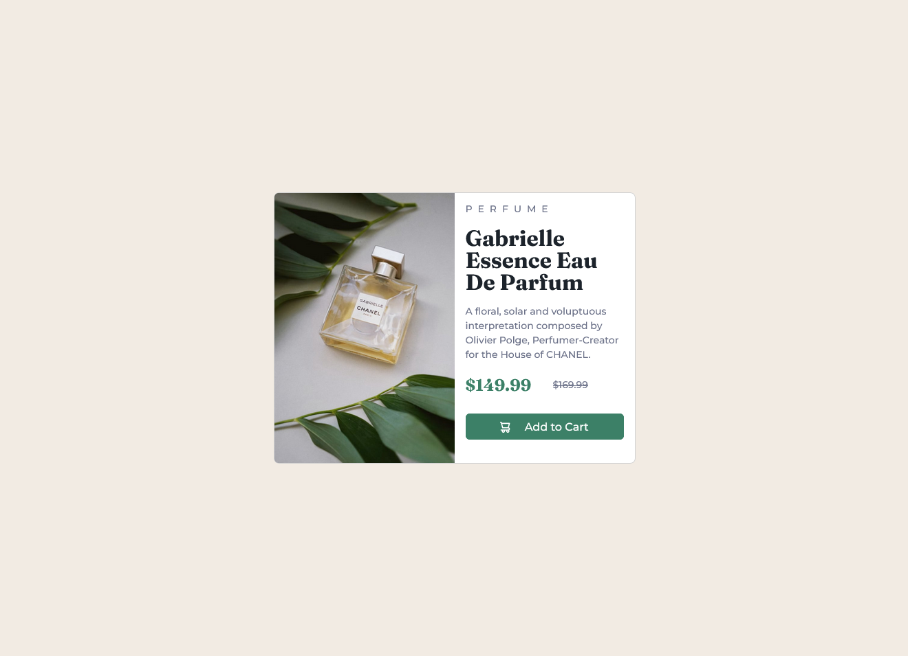

# Frontend Mentor - Product preview card component solution

This is a solution to the [Product preview card component challenge on Frontend Mentor](https://www.frontendmentor.io/challenges/product-preview-card-component-GO7UmttRfa). Frontend Mentor challenges help you improve your coding skills by building realistic projects.

## Table of contents

- [Frontend Mentor - Product preview card component solution](#frontend-mentor---product-preview-card-component-solution)
  - [Table of contents](#table-of-contents)
  - [Overview](#overview)
    - [The challenge](#the-challenge)
    - [Screenshot](#screenshot)
  - [My process](#my-process)
    - [Built with](#built-with)
    - [What I learned](#what-i-learned)
  - [Author](#author)

## Overview

### The challenge

Users should be able to:

- View the optimal layout depending on their device's screen size
- See hover and focus states for interactive elements

### Screenshot



## My process

### Built with

- CSS custom properties
- Mobile-first workflow
- [Bootstrap](https://getbootstrap.com/)

### What I learned

The HTML `<picture>` element allows you to display different pictures for different devices or screen sizes.

```html
<picture>
  <source
    media="(max-width: 375px)"
    srcset="./images/image-product-mobile.jpg"
  />
  <source
    media="(max-width: 1440px)"
    srcset="./images/image-product-desktop.jpg"
  />
  
</picture>
```

## Author

- Website - [Abuzer Emre Osmanoğlu](https://abuzeremre.com)
- Frontend Mentor - [@aeosmanoglu](https://www.frontendmentor.io/profile/aeosmanoglu)
- Twitter - [@abuzeremreo](https://twitter.com/abuzeremreo)
